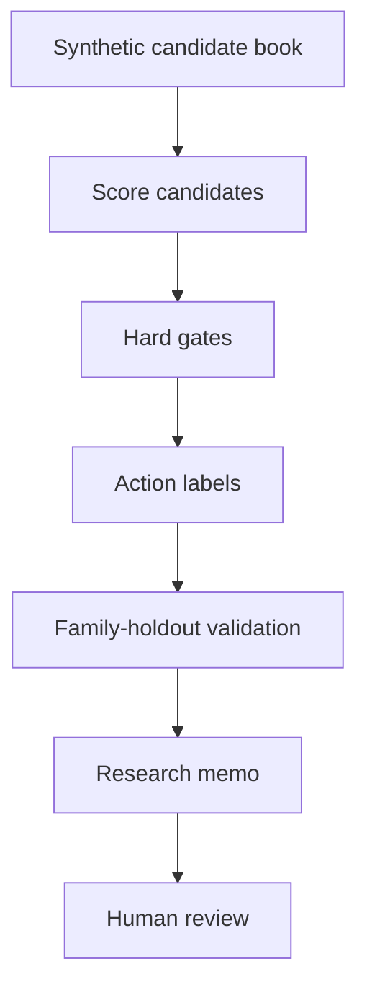

# Architecture

## Design Choices

The workflow is intentionally conservative.

`score_candidates.py` separates the score into visible components:

- `quality_component`
- `risk_penalty`
- `crowding_penalty`
- `novelty_component`
- `feasibility_component`

This matters because a single opaque score is easy to overtrust. The decision needs to explain whether a candidate is strong, novel, feasible, or just a duplicate of something already known.

## Gates

The hard gates block candidates with:

- weak Sharpe or fitness
- thin margin
- high drawdown or turnover
- high self-correlation
- high active-book similarity
- crowded formula family
- high out-of-sample decay
- weak data coverage
- high complexity without enough edge

## Validation

The validation script compares random candidate-id splits against formula-family holdouts. The difference is reported as an optimism gap.

That gap is the kind of thing a real research process should care about. If random splits look much better than family holdouts, the system is probably learning duplicate formula structure instead of durable edge.
