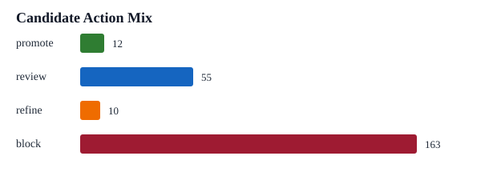

# Research Memo

## Executive Readout

- Screened `240` synthetic-but-realistic signal candidates across `12` formula families.
- Promoted `12` candidates, kept `55` for review, sent `10` to refinement, and blocked `163`.
- The workflow optimizes for useful research throughput, not raw idea count.
- Main controls: self-correlation, active-book similarity, family saturation, OOS decay, margin, and coverage.

## Top Candidates

| Rank | Candidate | Family | Action | Score | Sharpe | Fitness | Self-Corr | Novelty | Main Reason |
|---:|---|---|---|---:|---:|---:|---:|---:|---|
| 1 | C0070 | capital_efficiency | promote | 1.2249 | 1.50 | 1.30 | 0.29 | 0.63 | `pass` |
| 2 | C0207 | quality_revision | promote | 1.2213 | 1.28 | 1.04 | 0.12 | 0.93 | `pass` |
| 3 | C0097 | capital_efficiency | promote | 1.2140 | 1.42 | 1.16 | 0.20 | 0.65 | `pass` |
| 4 | C0054 | capital_efficiency | promote | 1.1955 | 1.78 | 1.23 | 0.12 | 0.75 | `pass` |
| 5 | C0008 | analyst_revision | promote | 1.1506 | 1.51 | 1.25 | 0.32 | 0.93 | `pass` |
| 6 | C0133 | short_interest_stress | promote | 1.0612 | 1.07 | 1.02 | 0.13 | 0.69 | `pass` |
| 7 | C0099 | earnings_response | promote | 1.0285 | 1.45 | 1.10 | 0.34 | 0.92 | `pass` |
| 8 | C0055 | asset_light_reinvestment | promote | 1.0186 | 1.49 | 1.13 | 0.42 | 0.78 | `pass` |
| 9 | C0182 | volume_reversal | promote | 0.9931 | 1.09 | 1.18 | 0.23 | 0.72 | `pass` |
| 10 | C0228 | capital_efficiency | promote | 0.9917 | 1.11 | 1.03 | 0.28 | 0.84 | `pass` |

## Blocked Candidates Worth Learning From

| Rank | Candidate | Family | Action | Score | Sharpe | Fitness | Self-Corr | Novelty | Main Reason |
|---:|---|---|---|---:|---:|---:|---:|---:|---|
| 1 | C0238 | earnings_response | block | 0.8376 | 0.77 | 0.87 | 0.24 | 0.86 | `weak_sharpe` |
| 2 | C0078 | capital_efficiency | block | 0.8154 | 1.22 | 1.19 | 0.50 | 0.49 | `coverage_gap` |
| 3 | C0224 | capital_efficiency | block | 0.7616 | 1.27 | 1.29 | 0.31 | 0.73 | `oos_decay_risk` |
| 4 | C0088 | options_pressure | block | 0.7248 | 1.03 | 1.11 | 0.55 | 0.93 | `coverage_gap` |
| 5 | C0135 | quality_revision | block | 0.7173 | 0.77 | 0.82 | 0.21 | 0.61 | `weak_sharpe` |
| 6 | C0061 | quality_revision | block | 0.7032 | 1.30 | 1.19 | 0.34 | 0.80 | `coverage_gap` |

## Main Gate Pressure

- `weak_sharpe`: 108
- `thin_margin`: 90
- `live_status_blocked`: 66
- `oos_decay_risk`: 44
- `coverage_gap`: 43
- `weak_fitness`: 35
- `crowded_family`: 23
- `turnover_risk`: 15
- `too_close_to_active_book`: 15
- `self_correlation_watch`: 9

## Validation Evidence

# Validation Report

This validation is designed around the main failure mode in signal research: near-duplicate formula families can make random splits look better than they are.

## Dataset

- Candidates: 240
- Formula families: 12
- Promote/review/refine/block: 12 / 55 / 10 / 163

## Leakage Check

- Random-id split average precision@10: `0.580`
- Formula-family holdout average precision@10: `0.520`
- Optimism gap: `+0.060`

If the random split is meaningfully better, the workflow treats that as a warning that candidates may be repeating the same idea rather than discovering independent evidence.

## Family Holdout Folds

| Fold | Candidates | Promote | Review | Refine | Block | Precision@10 | Mean Score |
|---:|---:|---:|---:|---:|---:|---:|---:|
| 0 | 18 | 1 | 7 | 0 | 10 | 0.200 | 0.1546 |
| 1 | 63 | 3 | 13 | 2 | 45 | 0.900 | 0.1007 |
| 2 | 58 | 0 | 8 | 3 | 47 | 0.300 | -0.1941 |
| 3 | 52 | 6 | 15 | 3 | 28 | 0.700 | 0.2367 |
| 4 | 49 | 2 | 12 | 2 | 33 | 0.500 | 0.2302 |

## Main Gate Pressure

- `weak_sharpe`: 108
- `thin_margin`: 90
- `live_status_blocked`: 66
- `oos_decay_risk`: 44
- `coverage_gap`: 43
- `weak_fitness`: 35
- `crowded_family`: 23
- `turnover_risk`: 15

## Interpretation

A good research system should not only rank candidates. It should explain which constraints are binding. Here, the most useful output is the combination of action labels, gate reasons, and family-holdout precision.

## Decision Rule

A candidate only moves forward if it has enough edge, enough novelty, and low enough self-correlation to justify more research time. Strong-looking candidates are still blocked when they are too crowded or when the validation pattern suggests duplicated evidence.

## Next Research Action

Inspect the top promoted family manually, then run a targeted refinement pass on `refine` candidates with self-correlation watch flags. Do not expand blocked families until the binding gate is addressed.
